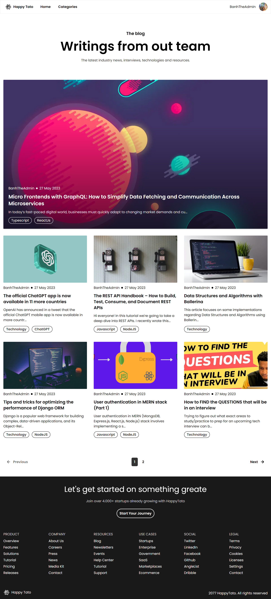
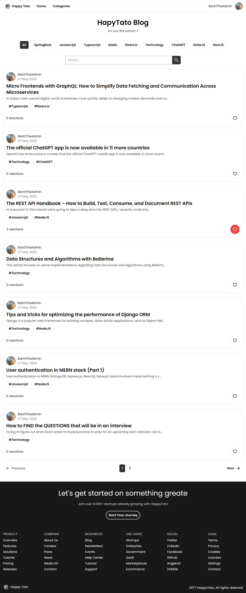
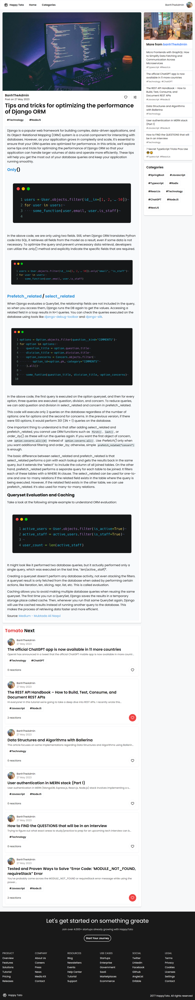
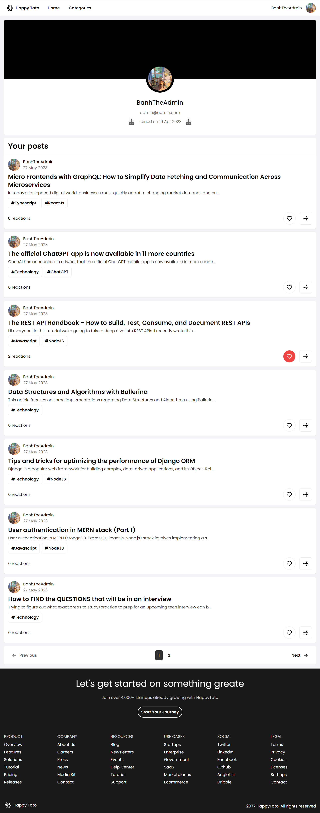
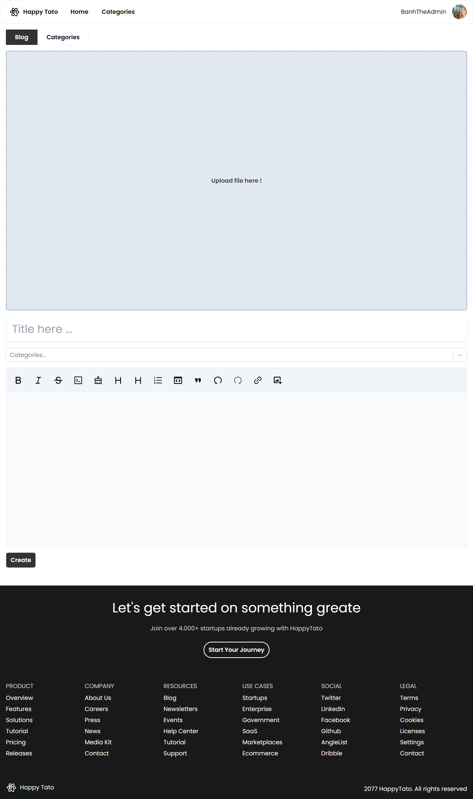
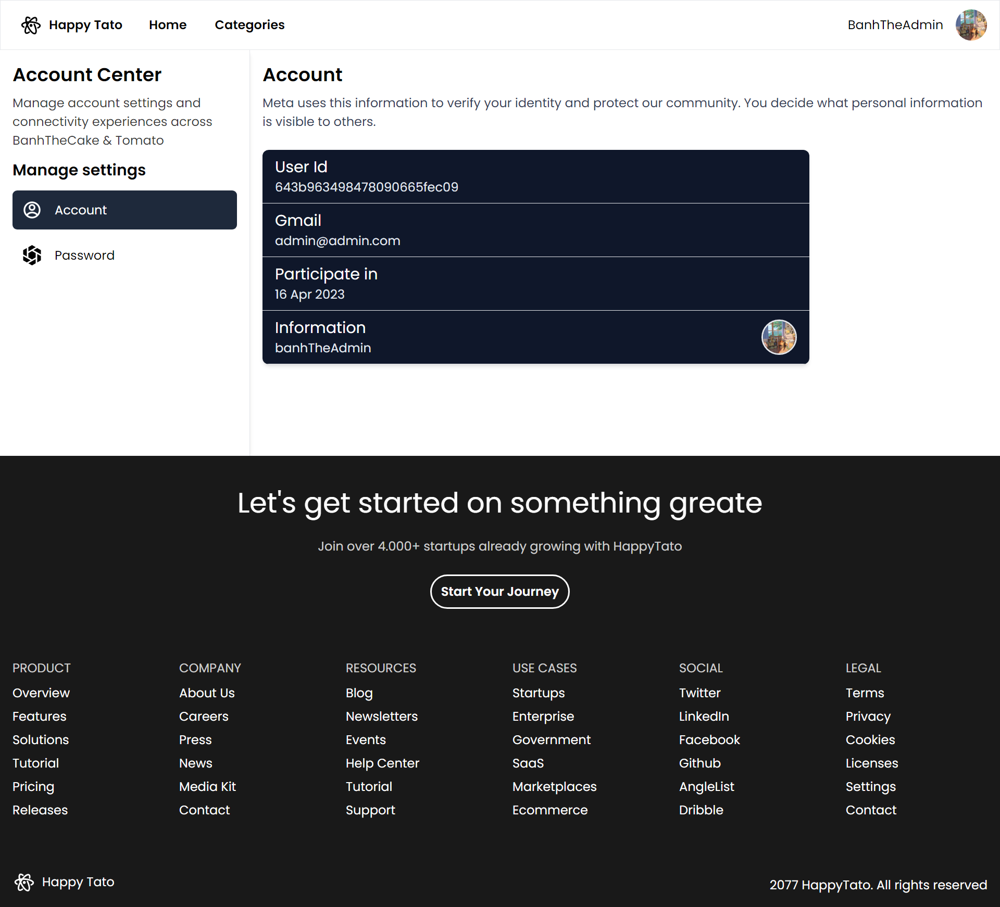

## Introduction

---

HappyTato is a website that provides quality blogs, allowing you to create and manage blog with Admin permission. built using [Next.js](https://nextjs.org/) for the frontend and [Nest.js](https://nestjs.com/) with [GraphQL](https://graphql.org/) for the backend

## Tech Stack

---

-   [Next.js](https://nextjs.org/) – framework
-   [Typescript](https://www.typescriptlang.org/) – language
-   [Tailwind](https://tailwindcss.com/) – CSS
-   [Uploadthing](https://uploadthing.com/) (beta) - store images
-   [Nest.js](https://nestjs.com/) – backend
-   [MongoDB](https://www.mongodb.com/) – database
-   [GraphQL](https://graphql.org/) – api
-   [Tiptap](https://tiptap.dev/) – editor

## Features

---

-   Pagination - Search by keyword
-   Like post - use with socket for realtime
-   Send email for active account or reset password
-   Full responsive
-   Auth with JWT
-   Authorization
-   Persist login - protected routes with middleware NextJS
-   Store image on [Uploadthing](https://uploadthing.com/)

## ScreenShots

---

-   Home page

-   Categories

-   Details post

-   Author

-   Create page

-   Settings

